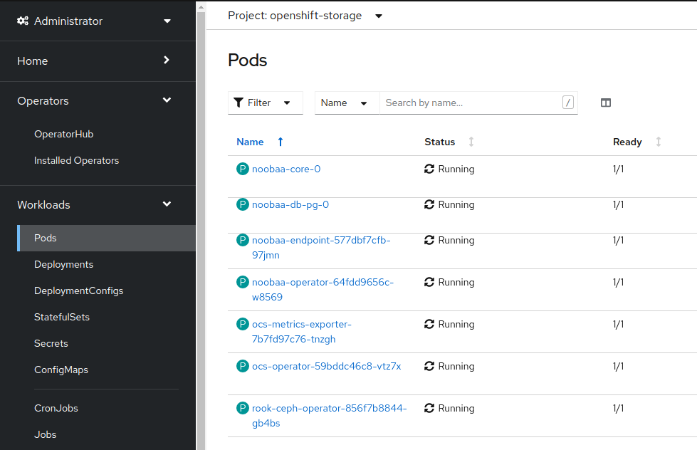

= Configuring the OpenShift Cluster

This section will walk you through the steps needed to configure your cluster to run the Legacy Rehost workshop.

== Provision OpenShift Cluster

This workshop is intended to run on the `OpenShift 4.8 Workshop` from RHPDS. So the first thing you need to do is login to RHPDS and provision the OpenShift 4.8 Workshop Service.

image::./workshop/content/exercises/Images/ClusterConfigRHPDSService.png[image]

Once the provision is complete, login to the OpenShift UI to begin configuring the cluster.

== Install OpenShift Container Storage Operator

Go to the OperatorHub and search for `OpenShift Container Storage`.

image::./workshop/content/exercises/Images/ClusterConfigOperatorHubOCS.png[image]

Click on the `OpenShift Container Storage` item and then click `Install`.

Do not modify any of the settings. Click `Install`.


The install will take a few minutes to complete.

image::./workshop/content/exercises/Images/ClusterConfigOCSInstallComplete.png[image]

Once the operator deployment is complete, configure the NooBaa storage by importing the following yaml using the `+` icon in the upper right corner of the page:

```
apiVersion: noobaa.io/v1alpha1
kind: NooBaa
metadata:
  name: noobaa
  namespace: openshift-storage
spec:
  dbType: postgres
  dbResources:
    requests:
      cpu: '0.1'
      memory: 1Gi
  coreResources:
    requests:
      cpu: '0.1'
      memory: 1Gi
```


Once the NooBaa installation is complete, you are ready to deploy the Quay registry.



== Deploy Quay Registry

Go to the OperatorHub and search for `Quay`.

image::./workshop/content/exercises/Images/ClusterConfigOperatorHubQuay.png[image]

Click on the `Red Hat Quay` item and then click `Install`.

Do not modify any of the settings. Click `Install`.

image::./workshop/content/exercises/Images/ClusterConfigInstallQuayOperator.png[image]

Once the installation is complete, click `View Operator`.


Click on `Create instance` to create the Quay registry.


Set `Name` to be `local-registry` and then click on `Create`.

IMPORTANT: The name is very important. The documentation uses string interpolation which depends on a specific name for the registry.

image::./workshop/content/exercises/Images/ClusterConfigCreateRegistry.png[image]

Once the instance is ready, use the side bar to navigate to Networking -> Routes and click on the Location (URL) for the `local-registry-quay` Route which will bring you to the login page of the Quay registry.

NOTE: Make sure you are in the `openshift-operators` project when looking for the route


Click on `Create Account` to create a username and password for the registry.

image::./workshop/content/exercises/Images/ClusterConfigQuayLoginPage.png[image]

After you enter the required information, click on `Create Account`.


You will be brought to the Quay registry's Repositories page.

We are going to create two organizations in our repository. One for the JBoss images and another for the WebLogic images.

IMPORTANT: The organizations are required and the names are important because the string interpolation in the documentation relies on specific names

On the right hand side, there is a `Users and Organizations` box. Click on `Create New Organization` inside that box.

image::./workshop/content/exercises/Images/ClusterConfigQuayHomePage.png[image]
