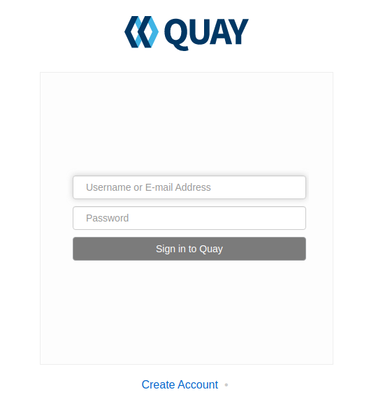
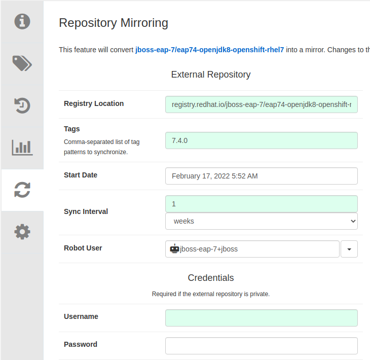

= Configuring the OpenShift Cluster

This section will walk you through the steps needed to configure your cluster to run the Legacy Rehost workshop.

== Provision OpenShift Cluster

This workshop is intended to run on the `OpenShift 4.8 Workshop` from RHPDS. So the first thing you need to do is login to RHPDS and provision the OpenShift 4.8 Workshop Service.


Once the provision is complete, login to the OpenShift UI to begin configuring the cluster.

== Build WebLogic Domain Image

While the cluster is being provisioned, you can start building the WebLogic domain image that is needed for the WebLogic section of the workshop.

Follow the prerequisites, part 1, part 4, and part 5 from https://github.com/jnovotni/weblogic-operator-on-openshift to build the image

This image will be pushed to the registry later in the setup, once the Quay registry is configured and running.

== Install OpenShift Pipelines Operator

Go to the OperatorHub and search for `OpenShift Pipelines`.


Click on the `OpenShift Pipelines` item then click `Install`

Do not modify any of the settings. Click `Install`.


== Install JBoss Operator

Go to the OperatorHub and search for 'JBoss EAP'.


Click on the `JBoss EAP` item and then click `Install`.

Do not modify any of the settings. Click `Install'.


== Configure Cluster Storage

The OpenShift Container Storage Operator and NooBaa storage are needed for the Quay registry.

=== Install OpenShift Container Storage Operator

Go to the OperatorHub and search for `OpenShift Container Storage`.

image::./workshop/content/exercises/Images/ClusterConfigOperatorHubOCS.png[image]

Click on the `OpenShift Container Storage` item and then click `Install`.

Do not modify any of the settings. Click `Install`.

image::./workshop/content/exercises/Images/ClusterConfigInstallOCSOperator.png[image]

The install will take a few minutes to complete.


=== Configure NooBaa Storage

Once the operator deployment is complete, configure the NooBaa storage by importing the following yaml using the `+` icon in the upper right corner of the page:

```
apiVersion: noobaa.io/v1alpha1
kind: NooBaa
metadata:
  name: noobaa
  namespace: openshift-storage
spec:
  dbType: postgres
  dbResources:
    requests:
      cpu: '0.1'
      memory: 1Gi
  coreResources:
    requests:
      cpu: '0.1'
      memory: 1Gi
```

image::./workshop/content/exercises/Images/ClusterConfigImportNooBaaYAML.png[image]

Once the NooBaa installation is complete, you are ready to deploy the Quay registry.

image::./workshop/content/exercises/Images/ClusterConfigNooBaaInstallComplete.png[image]

== Setup Quay Registry

=== Install Quay Operator

Go to the OperatorHub and search for `Quay`.


Click on the `Red Hat Quay` item and then click `Install`.

Do not modify any of the settings. Click `Install`.


=== Create Quay Instance

Once the installation is complete, click `View Operator`.

image::./workshop/content/exercises/Images/ClusterConfigQuayInstallComplete.png[image]

Click on `Create instance` to create the Quay registry.

image::./workshop/content/exercises/Images/ClusterConfigQuayOperatorPage.png[image]

Set `Name` to be `local-registry` and then click on `Create`.

IMPORTANT: The name is very important. The documentation uses string interpolation which depends on a specific name for the registry.


Once the instance is ready, use the side bar to navigate to Networking -> Routes and click on the Location (URL) for the `local-registry-quay` Route which will bring you to the login page of the Quay registry.

NOTE: Make sure you are in the `openshift-operators` project when looking for the route

image::./workshop/content/exercises/Images/ClusterConfigRegistryRoute.png[image]

=== Create Username and Password

Click on `Create Account` to create a username and password for the registry.



After you enter the required information, click on `Create Account`.

image::./workshop/content/exercises/Images/ClusterConfigCreateQuayAccount.png[image]

You will be brought to the Quay registry's Repositories page.

=== Configure JBoss Organization

You are going to need two organizations in the repository. One for the JBoss images and another for the WebLogic images.

IMPORTANT: The organizations are required and the names are important because the string interpolation in the documentation relies on specific names

On the right hand side, there is a `Users and Organizations` box. Click on `Create New Organization` inside that box.


Enter `jboss-eap-7` for `Organization Name` and then click `Create Organization`.


Click on `Create New Repository` in the upper right corner of the page.

NOTE: Make sure you are in the jboss-eap-7 organization

You are going to create four repositories in this organization. You will be repeating this process for all four repositories.

The first repository will be named `eap74-openjdk8-openshift-rhel7`.

Set the repository to `Public` and then click `Create Public Repository`.


Click on the gear icon on the side bar to configure the repository's settings.

Scroll to the bottom of the page and set `Repository State` to `Mirror`.


Click on the circular arrows icon on the side bar to configure the mirroring settings.



Set the following values:
```
Registry Location: registry.redhat.io/jboss-eap-7/eap74-openjdk8-openshift-rhel7

Tags: 7.4.0

Sync Interval: 1 week
```
`Robot User` is effectively a service account for accessing the necessary container images. This service account needs to access `registry.redhat.io`. Give the account a name and then provide your username and password.

Click on the drop down arrow next to the `Robot User` field and click `Create robot account`.


Give the account a name (jboss, redhat, etc) and click `Create robot account`.

Under the `Credentials` section, supply your username and password for registry.redhat.io and then click `Enable Mirror` at the bottom of the page.

Click on the bar chart icon to see the usage logs.


When you see the message `Mirror finished successfully...` you are finished mirroring the repository.

//I think only the jdk11 images are needed. Expand to show step by step for mirroring second image.
Repeat this process for:
```
registry.redhat.io/jboss-eap-7/eap74-openjdk8-runtime-openshift-rhel7
registry.redhat.io/jboss-eap-7/eap74-openjdk11-openshift-rhel8
registry.redhat.io/jboss-eap-7/eap74-openjdk11-runtime-openshift-rhel8
```

=== Congfigure Oracle Organization

Click on the `+` sign in the upper right corner and select `New Organization`.


Enter `oracle` for `Organization Name` and click `Create Organization`.

IMPORTANT: The name is important because the string interpolation in the documentation relies on specific names


Push the custom WebLogic domain image to this repo

Make the repository public

== Configure User Permissions

The rhpds cluster will come with user accounts. Use the `setup-environment.sh` script to configure the user permissions.

If you haven't already, clone this repository.

```
git clone https://github.com/jnovotni/legacy-rehost-homeroom-workshop.git
```
Change directories to the root directory of the repository.

```
cd legacy-rehost-homeroom-workshop
```

Login to the OpenShift cluster:
```
oc login --token=sha256~xxxxxxxxxxxxxxxxxxxxxxxxxxxxxxxxxxxxxxxxxxx --server=https://api.ocp.example.com:6443
```

Run the script to configure the user permissions. The script takes the number of users as a parameter. In this example, I am configuring permissions for 10 users.
```
.workshop/scripts/setup-projects.sh 10
```
NOTE: Don't worry about the "user not found" warnings. The permissions will be applied when the user logs in.

The user permissions are now set.

== Deploying the Workshop

Create a project for the workshop by running the following command:
```
oc new-project legacy-rehost-workshop
```

Deploy the workshop spawner by running the following script:

NOTE: You must be a cluster admin to be able to deploy the workshop using the spawner.
```
.workshop/scripts/deploy-spawner.sh --settings=hosted-workshop
```

//This step will not be needed in the future. Workshop is  still in development.
Build the workshop before login to add the custom content to the workshop by running the following script:
```
.workshop/scripts/build-workshop.sh
```

Get the route to the workshop by running the following command.
```
oc get route -n workshops
```

Users can login using the same logins they would use to login to the cluster.
