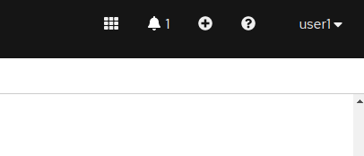

= Rehosting Legacy Applications

== Introduction

There are many companies running legacy software. Many of these companies realize that they need to modernize their applications, infrastructure, and processes if they are going to meet the growing demands of their customers.

Rewriting legacy code to take advantage of all of the features that containers offer can be a daunting undertaking. In addition to refactoring the existing code, the effort may require training existing staff or hiring new staff, which isn’t always an option.

While sorting out all of the details of modernizing your applications, you can still get the features and benefits that the OpenShift platform offers with your existing applications. You can start breaking apart your monolithic applications into containerized services one piece at a time and run them side by side on the same platform. You will be able manage your legacy applications as well as your new cloud native applications using the same processes and platform.

This workshop is going to show you how you can take your existing applications (without modifying any code) and run them on the OpenShift platform.

== Environment Overview
This section will discuss some helpful tips for navigating the workshop. Return to this page any time throughout the workshop.

=== Execute Commands
Throughout the workshop, you will see text boxes like the one below. You are able to click on these boxes to execute the command automatically. Try it with the following command:
[source,bash,role=execute]
----
oc version
----

=== Log in to OpenShift Cluster
You should already be logged into the OpenShift cluster as user %username%. Verify this by running the following command:

[source,bash,role=execute]
----
oc whoami
----

The output of this command should be %username%

=== OpenShift UI
You can access the OpenShift UI at the following URL:
```
console-openshift-console.%cluster_subdomain%
```
Your login credentials will be %username%/openshift

=== Importing YAML
There may be times that you need to use the OpenShift UI to import a YAML definition. You will need to click on the `+` icon in the upper right hand corner.



After clicking on this button, you will be brought to a page where you can paste your YAML text.

image::./Images/ImportYaml.png[image]

After you have pasted your text, click on `Create` at the bottom of the page.

== Sections

Feel free to complete one or all of the sections of the workshop.

<<JBossRehost.adoc#, Rehosting a JBoss Application>>

<<WebSphereRehost.adoc#, Rehosting a WebSphere Application>>

<<WebLogicRehost.adoc#, Rehosting a WebLogic Application>>

<<OpenShiftPipelines.adoc#, Deploying a WebSphere Application Using OCP Pipelines>>
