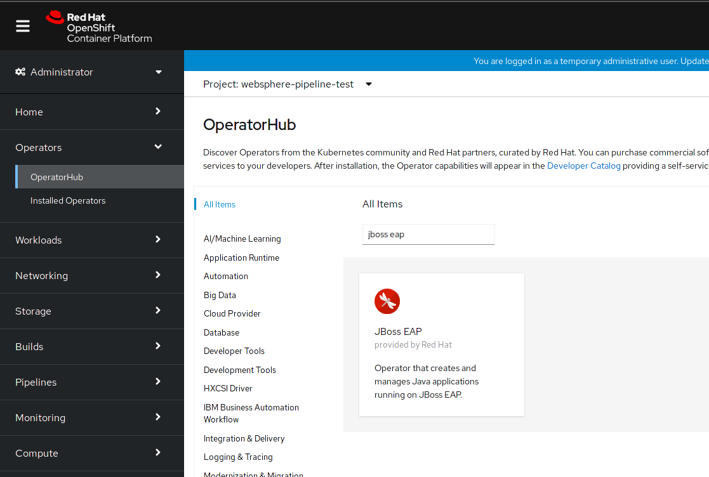
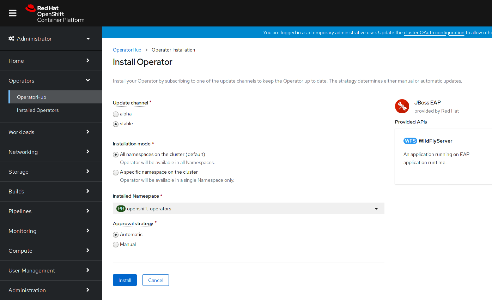
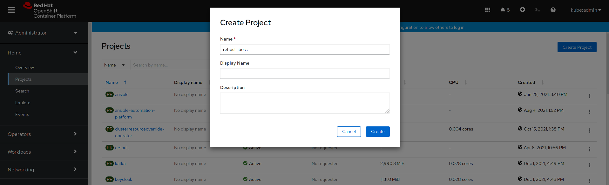
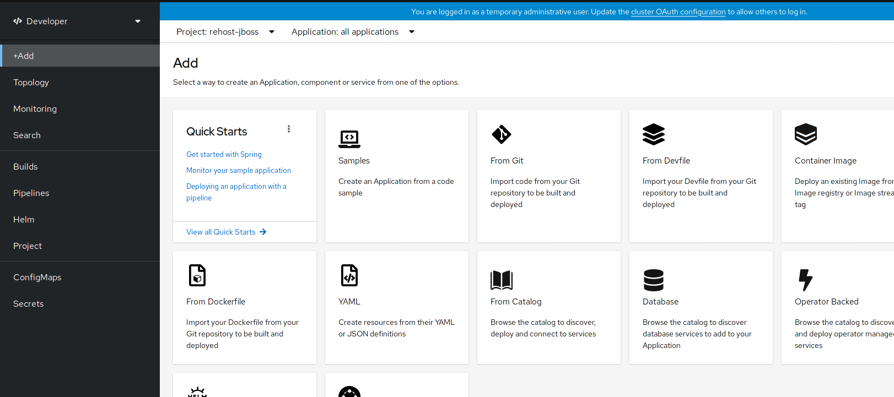
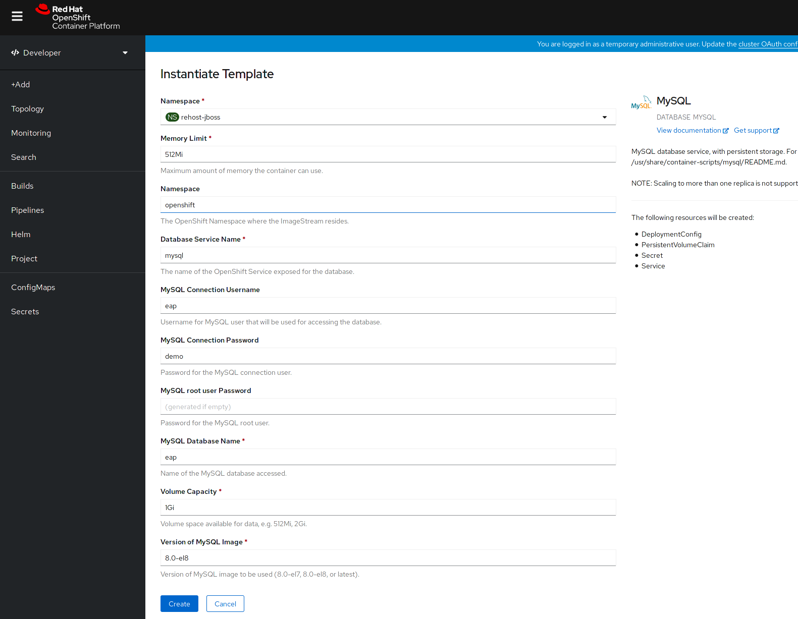
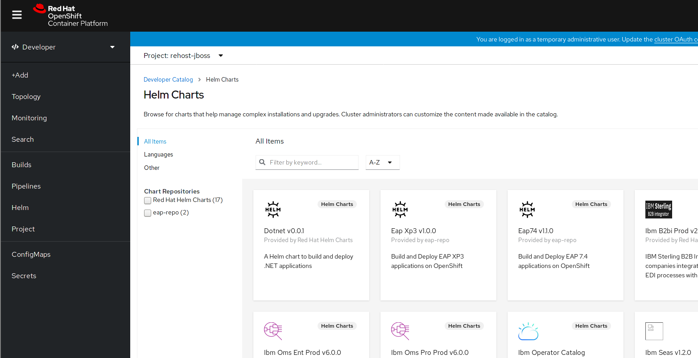
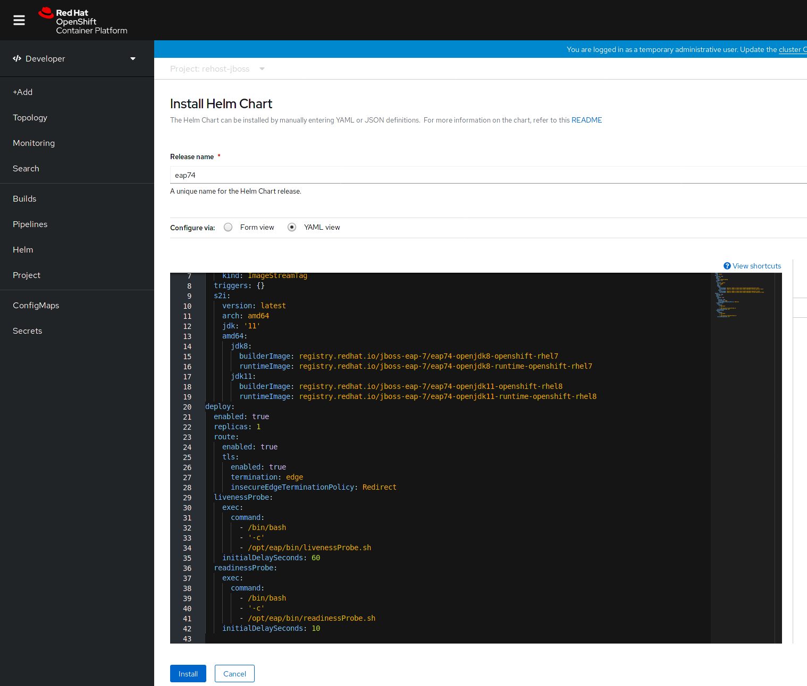
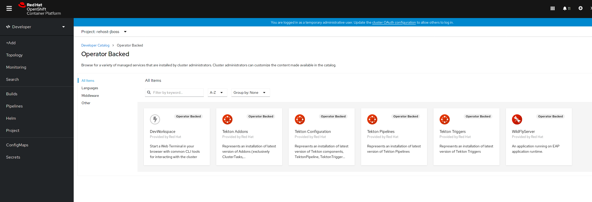
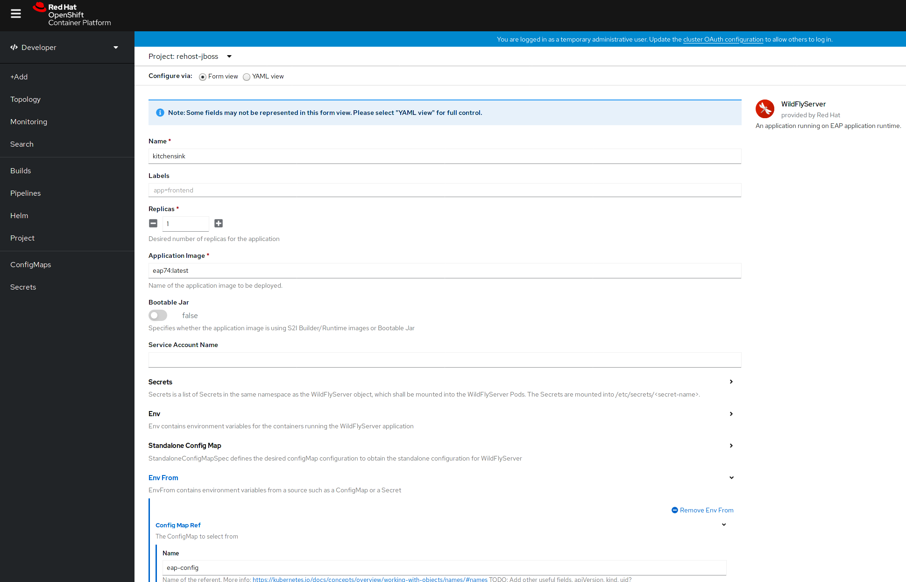
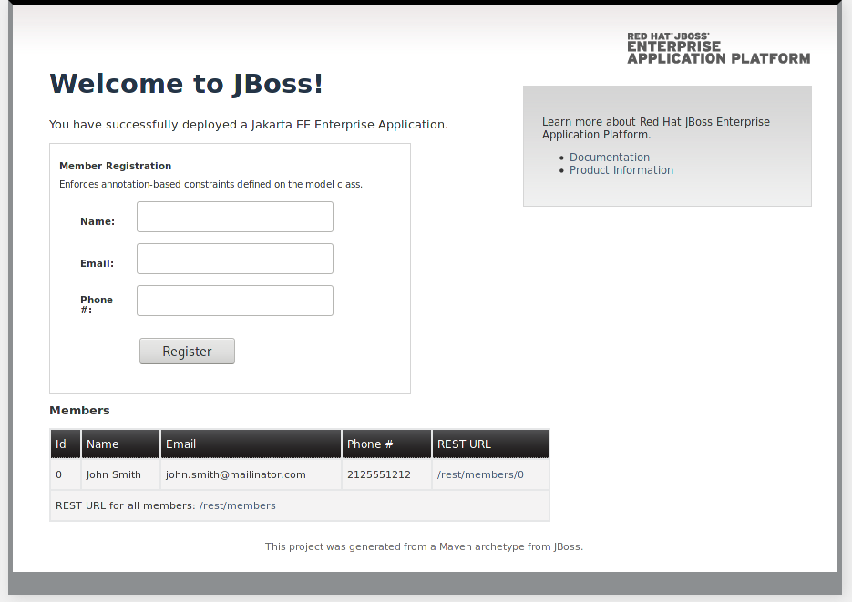

= Rehosting a JBoss Application

== Introduction

Red Hat JBoss Enterprise Application Platform is an application server that serves as a middleware platform and is built on open standards and compliant with the Jakarta EE and Eclipse MicroProfile specifications via JBoss Enterprise Application Platform expansion pack (JBoss EAP XP). It is the leading open source platform for next-generation Java and Jakarta EE applications. It's integrated, simplified, and delivered by the leader in enterprise open source software.

== Steps

In this section, we will be walking you through the deployment of an existing JBoss application onto OpenShift without making any modifications to the code.

=== Install JBoss EAP Operator

The first step is to install the JBoss EAP Operator. You can find the Operator in the OperatorHub by searching for `jboss eap`.



Install the JBoss EAP Operator with the default settings. It may take a few minutes to complete the installation.



=== Create a Project

Now we need to create a Project for the application. Go to the Project tab and click the `Create Project` button in the upper right hand corner. Enter the name `rehost-jboss` for the Name and click `Create`.



=== Deploy a MySQL Database

We're going to switch over to the Developer Perspective for the following steps.

image::./Images/SelectDeveloperView.png[image]

We are going to add a MySQL database to our application. Click on the `+Add` button in the top left and then select the `Database` option.



Update the following fields with the corresponding values then click `Create`.

```
MySQL Connection Username: eap
MySQL Connection Password: demo
MySQL Database Name: eap
```



The database will take a moment to finish deploying. You can view it's progress in the Topology tab. Click on the `mysql` icon to view more information about the deployment.

image::./Images/DeployedDatabase.png[image]

=== Build the Application

We are going to build our application using a Helm chart. Import the following yaml definition by clicking on the `+` sign in the upper right hand corner. This will configure the necessary Helm repo in our cluster.

```
apiVersion: helm.openshift.io/v1beta1
kind: HelmChartRepository
metadata:
  name: eap-repo
spec:
  name: eap-repo
  connectionConfig:
    url: https://jbossas.github.io/eap-charts/
```

The application will need to pull an image from the Reg Hat registry so we need to add a pull secret and name it `my-pull-secret`

*Configure the cluster with a global pull secret so it's already there for everyone*

Click on `+Add` in the side menu. Select Helm Charts. We will be using one of the Helm charts we just imported.

Select `Eap74 v1.1.0`



Select the `YAML View`



Overwirte the existing yaml with the following yaml definition and click `Install`.

```
image:
  tag: latest
build:
  enabled: true
  mode: s2i
  uri: 'https://github.com/deewhyweb/eap-quickstarts.git'
  ref: 7.4.x
  contextDir: kitchensink
  pullSecret: my-pull-secret
  output:
    kind: ImageStreamTag
  env:
    - name: MAVEN_ARGS_APPEND
      value: '-Dcom.redhat.xpaas.repo.jbossorg'
    - name: CUSTOM_INSTALL_DIRECTORIES
      value: extensions
  triggers: {}
  s2i:
    version: latest
    arch: amd64
    jdk: '11'
    amd64:
      jdk8:
        builderImage: registry.redhat.io/jboss-eap-7/eap74-openjdk8-openshift-rhel7
        runtimeImage: registry.redhat.io/jboss-eap-7/eap74-openjdk8-runtime-openshift-rhel7
      jdk11:
        builderImage: registry.redhat.io/jboss-eap-7/eap74-openjdk11-openshift-rhel8
        runtimeImage: registry.redhat.io/jboss-eap-7/eap74-openjdk11-runtime-openshift-rhel8
deploy:
  enabled: false
  replicas: 1
  route:
    enabled: true
    tls:
      enabled: true
      termination: edge
      insecureEdgeTerminationPolicy: Redirect
  livenessProbe:
    exec:
      command:
        - /bin/bash
        - '-c'
        - /opt/eap/bin/livenessProbe.sh
    initialDelaySeconds: 60
  readinessProbe:
    exec:
      command:
        - /bin/bash
        - '-c'
        - /opt/eap/bin/readinessProbe.sh
    initialDelaySeconds: 10
```

Go watch the application build.

It's building the application and then it's putting the application on a base image.

When the builds finish, we are ready to deploy our application.

=== Deploy the Application

Let's deploy the application using the image we just built along with the options we set in our ConfigMap.

We are going to use the JBoss EAP Operator to help us deploy the application. Click on `+Add` in the side menu and choose `Operator Backed`.

Select `WildFlyServer` and click `Create`.



Update the following fields with the corresponding values then click `Create`.

```
Name: kitchensink
Replicas: 1
Application Image: eap74:latest
Env From
  Config Map Ref
    Name: eap-config
```



We can watch the application's deployment progress in the Topology view. Click on the application's icon to view more information.

image::./Images/TopologyView.png[image]

When the application has finished deploying, we can visit the URL, provided under `Routes`, and see the login page.




== Review
In this section, we showed you how to take an existing JBoss application and deploy it on OpenShift without any modification to the code.

== Sections

<<Introduction.adoc#, Back to the Introduction>>

<<WebSphereRehost.adoc#, Rehosting a WebSphere Application>>

<<WebLogicRehost.adoc#, Rehosting a WebLogic Application>>

<<OpenShiftPipelines.adoc#, Deploying a WebSphere Application Using OCP Pipelines>>
