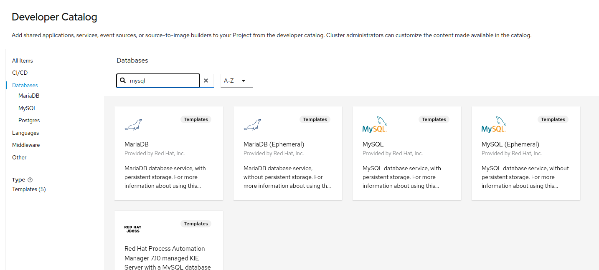
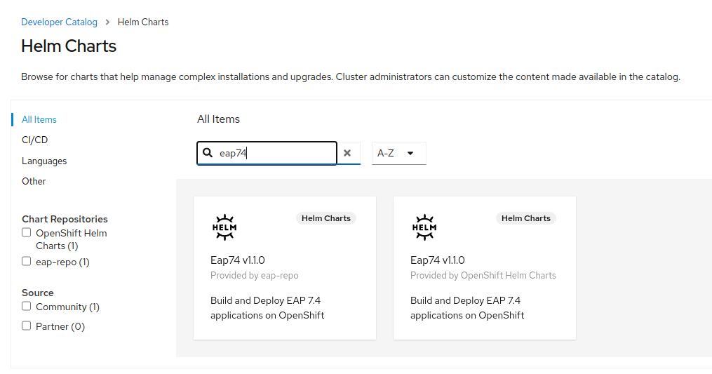
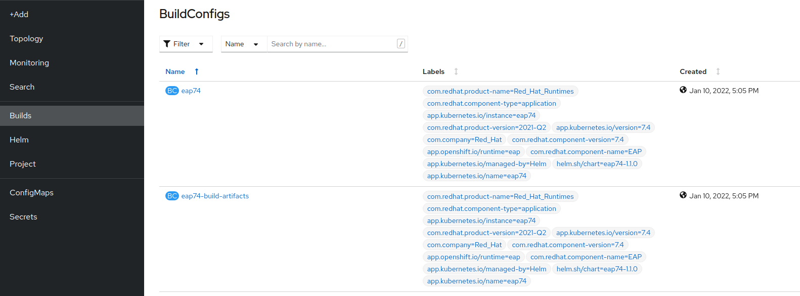
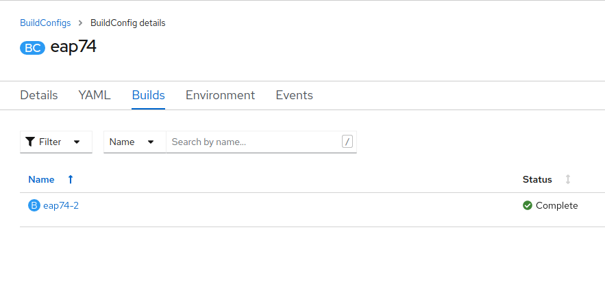

= Rehosting a JBoss Application

== Introduction

Red Hat JBoss Enterprise Application Platform is an application server that serves as a middleware platform and is built on open standards and compliant with the Jakarta EE and Eclipse MicroProfile specifications via JBoss Enterprise Application Platform expansion pack (JBoss EAP XP). It is the leading open source platform for next-generation Java and Jakarta EE applications. It's integrated, simplified, and delivered by the leader in enterprise open source software.

== Steps

In this section, we will be walking you through the deployment of an existing JBoss application onto OpenShift without making any modifications to the code.

=== Create a Project
The cluster admin has already installed the JBoss EAP Operator using the OperatorHub.

//create the project using the terminal instead
We need to create a Project for the application.

Run the following command to create the project.
[source,bash,role=execute]
----
oc new-project rehost-jboss-%username%
----

=== Deploy a MySQL Database

We are going to add a MySQL database to our application.

In the OpenShift UI, make sure you are in the Developer perspective and make sure you are in the rehost-jboss-%username% project.

 Click on the `+Add` button in the top left and then select the `Database` option.

//update the image
image::./Images/AddDatabase.png[image]

Search for `mysql` and select the MySQL catalog item.



Update the following fields with the corresponding values then click `Create`.

```
MySQL Connection Username: eap
MySQL Connection Password: demo
MySQL Database Name: eap
```

image::./Images/DatabaseSettings.png[image]

The database will take a moment to finish deploying. You can view it's progress in the Topology tab. Click on the `mysql` icon to view more information about the deployment.

image::./Images/DeployedDatabase.png[image]

=== Build the Application

We are going to build our application using a Helm chart.

Click on `+Add` in the side menu. Select Helm Charts.

Search for `eap` and Select `Eap74 v1.1.0`



Select the `YAML View`

image::./Images/EAPHelmChartYAMLView.png[image]

Overwirte the existing yaml with the following yaml definition and click `Install`.
NOTE: You need to update <local-quay-registry> with the appropriate url!

```
image:
  tag: latest
build:
  enabled: true
  mode: s2i
  uri: 'https://github.com/deewhyweb/eap-quickstarts.git'
  ref: 7.4.x
  contextDir: kitchensink
  output:
    kind: ImageStreamTag
  env:
    - name: MAVEN_ARGS_APPEND
      value: '-Dcom.redhat.xpaas.repo.jbossorg'
    - name: CUSTOM_INSTALL_DIRECTORIES
      value: extensions
  triggers: {}
  s2i:
    version: 7.4.0
    arch: amd64
    jdk: '11'
    amd64:
      jdk8:
        builderImage: <local-quay-registry>/jboss-eap-7/eap74-openjdk8-openshift-rhel7
        runtimeImage: <local-quay-registry>/jboss-eap-7/eap74-openjdk8-runtime-openshift-rhel7
      jdk11:
        builderImage: <local-quay-registry>/jboss-eap-7/eap74-openjdk11-openshift-rhel8
        runtimeImage: <local-quay-registry>/jboss-eap-7/eap74-openjdk11-runtime-openshift-rhel8
deploy:
  enabled: false
  replicas: 1
  route:
    enabled: true
    tls:
      enabled: true
      termination: edge
      insecureEdgeTerminationPolicy: Redirect
  livenessProbe:
    exec:
      command:
        - /bin/bash
        - '-c'
        - /opt/eap/bin/livenessProbe.sh
    initialDelaySeconds: 60
  readinessProbe:
    exec:
      command:
        - /bin/bash
        - '-c'
        - /opt/eap/bin/readinessProbe.sh
    initialDelaySeconds: 10
```

Click on the `Builds` tab on the side menu to see the BuildConfigs.



The eap74-build-artifacts build needs to finish running before the eap74 build will complete.

Click on `eap74-build-artifacts` and then select the `Builds` tab to see the build's status.

image::./Images/JBossEAP74BuildArtifactsBuildsTab.png[image]

Once that build is complete, go back to the BuildConfigs and click on `eap74`. Select the `Builds` tab to see the build's status.



//add an image to show what the build event tab looks like

When the builds are done, we are ready to deploy our application.

=== Deploy the Application

Let's deploy the application using the image we just built.

First, we need to set our MySQL options in a ConfigMap. Make sure you are in the rehost-jboss-%username% project.

Run the following command to create the ConfigMap.
[source,bash,role=execute]
----
cat <<EOF | oc apply -f -
kind: ConfigMap
apiVersion: v1
metadata:
  name: eap-config
data:
  DATASOURCES: "TEST"
  TEST_DATABASE: "eap"
  TEST_NAME: "mysql"
  TEST_DRIVER: "mysql"
  TEST_JNDI: "java:/jdbc/mysql"
  TEST_USERNAME: "eap"
  TEST_PASSWORD: "demo"
  TEST_URL: "jdbc:mysql://mysql:3306/eap"
  TEST_NONXA: "true"
EOF
----
\\\\
Click on the `+` symbol in the upper right hand corner of the web UI to import the following YAML. Paste the yaml below and click `Create`.
```
kind: ConfigMap
apiVersion: v1
metadata:
  name: eap-config
data:
  DATASOURCES: "TEST"
  TEST_DATABASE: "eap"
  TEST_NAME: "mysql"
  TEST_DRIVER: "mysql"
  TEST_JNDI: "java:/jdbc/mysql"
  TEST_USERNAME: "eap"
  TEST_PASSWORD: "demo"
  TEST_URL: "jdbc:mysql://mysql:3306/eap"
  TEST_NONXA: "true"
```
\\\\
We are going to use the JBoss EAP Operator to help us deploy the application. Click on `+Add` in the side menu and choose `Operator Backed`.

Select `WildFlyServer` and click `Create`.

image::./Images/OperatorBacked.png[image]

Update the following fields with the corresponding values then click `Create`.

```
Name: kitchensink
Replicas: 1
Application Image: eap74:latest
Env From
  Config Map Ref
    Name: eap-config
```

image::./Images/CreateWildFlyServer.png[image]

We can watch the application's deployment progress in the Topology view. Click on the application's icon to view more information.

image::./Images/TopologyView.png[image]

When the application has finished deploying, we can visit the URL, provided under `Routes`, and see the login page.

image::./Images/ApplicationLoginScreen.png[image]


== Review
In this section, we showed you how to take an existing JBoss application and deploy it on OpenShift without any modification to the code.

== Sections

<<Introduction.adoc#, Back to the Introduction>>

<<WebSphereRehost.adoc#, Rehosting a WebSphere Application>>

<<WebLogicRehost.adoc#, Rehosting a WebLogic Application>>

<<OpenShiftPipelines.adoc#, Deploying a WebSphere Application Using OCP Pipelines>>
