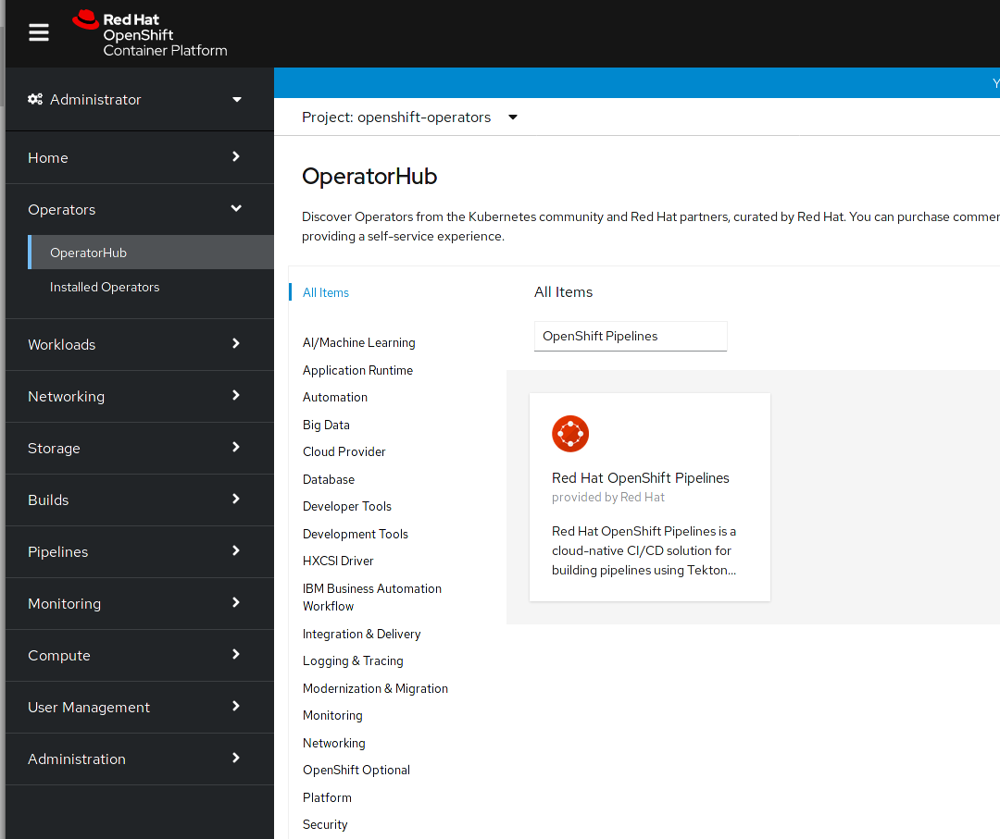
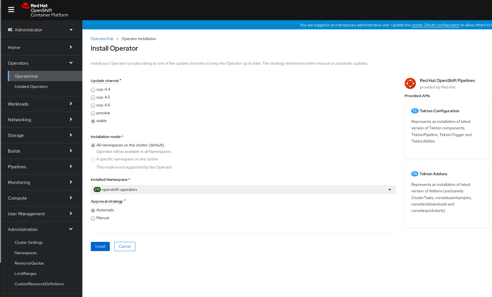
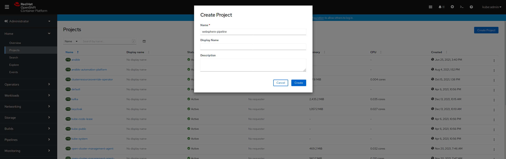
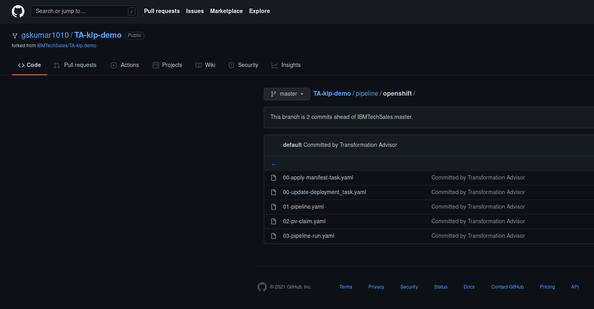
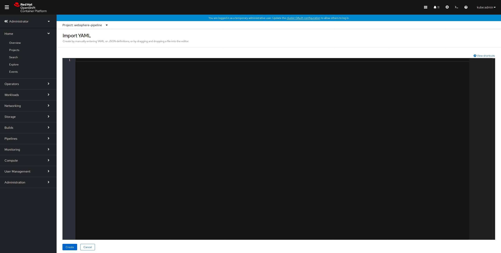
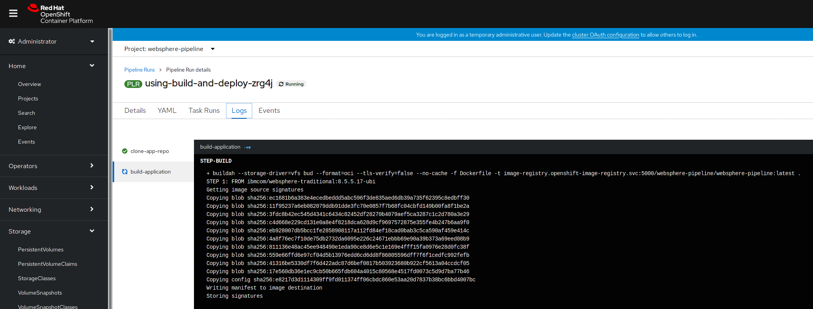
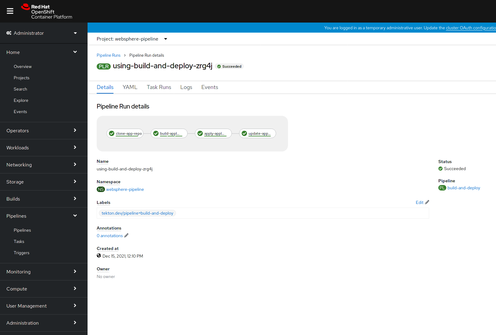
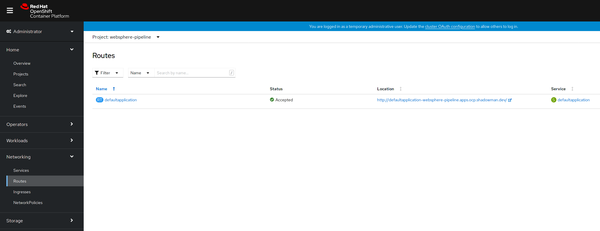
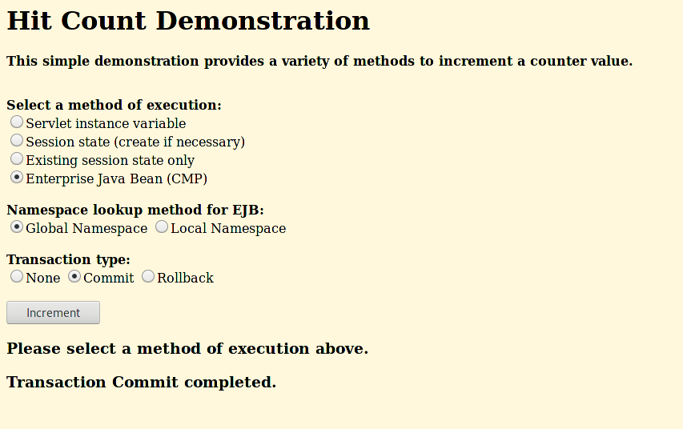
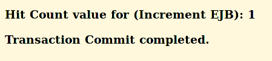

= Deploying a WebSphere Application Using OpenShift Pipelines

== Introduction

OpenShift Pipelines are neat. You should use them to deploy your WebSphere apps. TA generates a basic pipeline that you can use as a starting point.

== Steps

In this section, we will be walking you through the deployment of an OpenShift Pipeline that we will use to deploy your WebSphere application.

=== Install the Pipeline Operator

The first step is to deploy the OpenShift Pipeline Operator from the OperatorHub.

In the side menu, click on `Operators` and select `OperatorHub`. Search for `OpenShift Pipelines`.



Install the OpenShift Pipeline Operator using the default settings.



=== Create Pipeline Resources

Now that we have install the operator, we need to create our pipeline.

The first thing we need to do is create a project for our pipeline.

Click on `Home` in the side menu and select `Projects`. Click on `Create Project` in the upper right corner. Name the project `websphere-pipeline`.



Now we will create the pipeline resources. The IBM Transformation Advisor automatically generates the necessary yaml definitions for creating an OpenShift Pipeline that can deploy our WebSphere application.



We need to import each of these yaml files into OpenShift using the `+` icon in the upper right hand corner of the OpenShift UI and copying and pasting the contents of each file into the UI.



`00-apply-manifest-task.yaml` and `00-update-deployment_task.yaml` are custom tasks used by the pipeline.

```
apiVersion: tekton.dev/v1beta1
kind: Task
metadata:
  name: apply-manifests
spec:
  params:
  - name: manifest_dir
    description: The directory in source that contains yaml manifests
    type: string
  workspaces:
  - name: source
  steps:
  - name: apply
    image: quay.io/openshift/origin-cli:latest
    workingDir: $(workspaces.source.path)
    command: ["/bin/bash", "-c"]
    args:
    - |-
      echo Applying manifests in $(params.manifest_dir) directory
      oc apply -f $(params.manifest_dir)
      echo -----------------------------------
```

```
apiVersion: tekton.dev/v1alpha1
kind: Task
metadata:
  name: update-deployment
spec:
  params:
  - name: deployment
    description: The name of the deployment patch the image
    type: string
  - name: image-url
    description: The url of the image to patch
    type: string
  steps:
  - name: patch
    image: quay.io/openshift/origin-cli:latest
    command: ["/bin/bash", "-c"]
    args:
    - |-
      oc patch deployment $(params.deployment) --patch='{"spec":{"template":{"spec":{
        "containers":[{
          "name": "$(params.deployment)",
          "image":"$(params.image-url)"
        }]
      }}}}'
```

`01-pipeline.yaml` is the definition for the pipeline itself.

```
apiVersion: tekton.dev/v1beta1
kind: Pipeline
metadata:
  name: build-and-deploy
spec:
  params:
  - name: repo-url
    type: string
    description: The git repository URL to clone from.
  - name: branch-name
    type: string
    description: The git branch to clone.
    default: master
  - name: repo-context
    type: string
    description: The subfolder of the repo containing the dockerfile.
    default: .
  - name: repo-dockerfile
    type: string
    description: The name of the dockerfile to use.
    default: Dockerfile
  - name: image-url
    type: string
    description: The image to push to the registry.
  workspaces:
  - name: build-workspace
  tasks:
  - name: clone-app-repo
    taskRef:
      name: git-clone
      kind: ClusterTask
    params:
    - name: url
      value: $(params.repo-url)
    - name: revision
      value: $(params.branch-name)
    - name: deleteExisting
      value: "true"
    workspaces:
    - name: output
      workspace: build-workspace
  - name: build-application
    taskRef:
      name: buildah
      kind: ClusterTask
    runAfter:
    - clone-app-repo
    params:
    - name: IMAGE
      value: $(params.image-url)
    - name: DOCKERFILE
      value: $(params.repo-dockerfile)
    - name: CONTEXT
      value: $(params.repo-context)
    - name: TLSVERIFY
      value: "false"
    workspaces:
    - name: source
      workspace: build-workspace
  - name: apply-application-manifests
    taskRef:
      name: apply-manifests
    runAfter:
      - build-application
    params:
    - name: manifest_dir
      value: "pipeline/k8s"
    workspaces:
    - name: source
      workspace: build-workspace
  - name: update-application-image
    taskRef:
      name: update-deployment
    params:
    - name: deployment
      value: "defaultapplication"
    - name: image-url
      value: $(params.image-url)
    runAfter:
    - apply-application-manifests
```

`pv-claim.yaml` will create the persistent storage that the pipeline uses for persistent storage between tasks.

```
apiVersion: v1
kind: PersistentVolumeClaim
metadata:
  name: shared-task-storage
spec:
  resources:
    requests:
      storage: 100Mi
  accessModes:
    - ReadWriteOnce
```

=== Run the Pipeline

With all of our resources in place, we are ready to run our pipeline!

Importing `03-pipeline-run.yaml` will cause the pipeline to run and build our application. The `image-url` parameter needs to be updated with the correct project and application name. This has already been in the following yaml.

```
apiVersion: tekton.dev/v1beta1
kind: PipelineRun
metadata:
  generateName: using-build-and-deploy-
spec:
  pipelineRef:
    name: build-and-deploy
  workspaces:
  - name: build-workspace
    persistentVolumeClaim:
      claimName: shared-task-storage
  params:
  - name: repo-url
    value: https://github.com/IBMTechSales/TA-klp-demo.git
  - name: branch-name
    value: master
  - name: repo-dockerfile
    value: Dockerfile
  - name: image-url
    value: image-registry.openshift-image-registry.svc:5000/websphere-pipeline/websphere-pipeline:latest
```

The process will take a couple of minutes. You can view the pipeline's status in the UI.


The pipeline will clone the application's repo, build the application, apply manifests, and update the image.

To see more detailed information about what's going on, select the `Logs` tab.



After a few minutes the pipeline run will complete and our application will be deployed.



=== Access and Test the Application

Once the deployment is complete, we can access the application by using its route.

On the side menu, click on `Networking` and select `Routes`. You should see the route for the application that we just deployed. Under `Location`, you will see the application's URL.



Take the URL and add `/hitcount` to the end of it so that we hit our Hit Count application's end point. Paste this into your browser to access the application.

For example `http://defaultapplication-websphere-pipelines.apps.ocp.shadowman.dev/hitcount`

Select `Enterprise Java Bean (CMP)` as the method of execution, `Global Namespace` as the lookup method, and `Commit` as the transaction type. Click `Increment`.



You will see a message indicating that the count has been incremented.



== Review

In this section we were able to create an OpenShift Pipeline to deploy our application using the files generated by IBM's Transformation Advisor.

== Sections

<<Introduction.adoc#, Back to the Introduction>>

<<JBossRehost.adoc#, Rehosting a JBoss Application>>

<<WebSphereRehost.adoc#, Rehosting a WebSphere Application>>

<<WebLogicRehost.adoc#, Rehosting a WebLogic Application>>

<<OpenShiftPipelines.adoc#, Deploying a WebSphere Application Using OCP Pipelines>>
