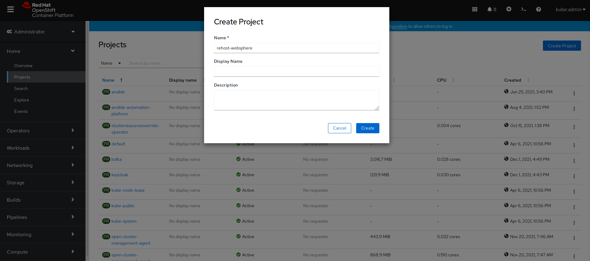
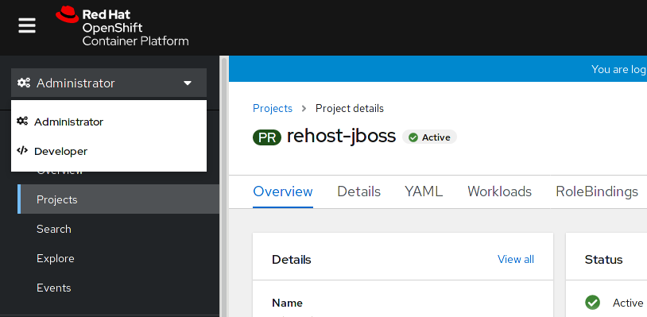
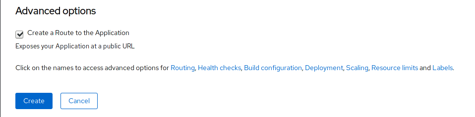
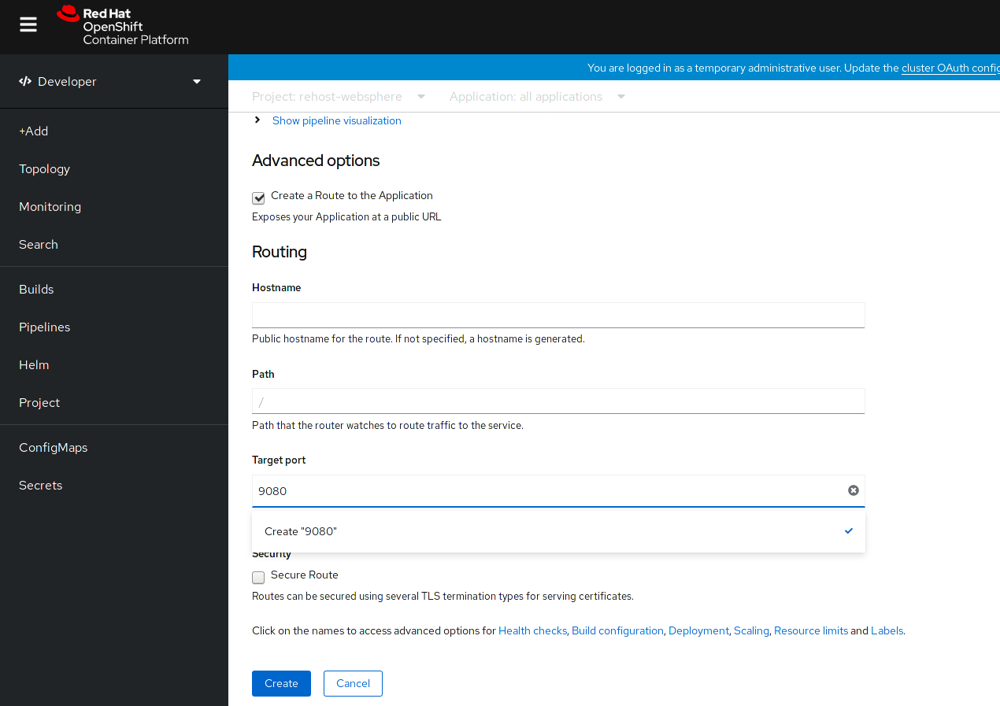
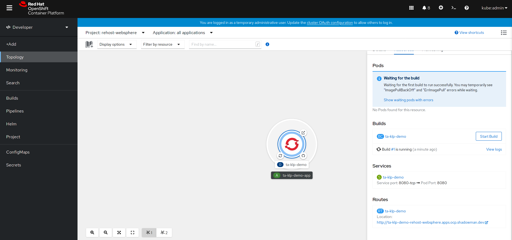
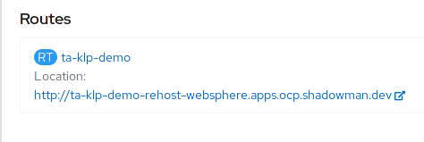

= Rehosting a WebSphere Application

== Introduction

Find IBM WebSphere sales pitch

== Steps

In this section, we will be walking you through the deployment of an existing WebSphere application onto OpenShift without making any modifications to the code.

=== Create Project

Go to the `Projects` tab and click on `Create Project` in the top right corner. Name the project `rehost-websphere` and click `Create`.

=== Deploy Application

We are going to switch to Developer perspective for the remainder of this section.

Click `+Add` in the upper left corner and select `From DockerFile`.

image::./Images/AddDockerFile.png[image]

Enter the GitHub Repo URL `https://github.com/gskumar1010/TA-klp-demo`. The fields will be auto-populated.

We need to update the port so that the deployment uses port 9080.

Scroll to the bottom where you will see a message `Click on the names to access advanced options for Routing, Health checks, Build configuration...`

Click on `Routing`. This will give us more options. Enter `9080` for `Target port` and click on the drop down option `Create "9080"`.

Click `Create`.

We can watch the application deployment in the `Topology` tab. The deployment will take a couple of minutes. We can click the icon to see more information about the deployment.

=== Access and Test the Application

Once the deployment is complete, we can access the application by using the URL under the Routes section of the Deployment information.

Take the URL and add `/hitcount` to the end of it so that we hit our Hit Count application's end point.

For example `http://ta-klp-demo-rehost-websphere.apps.ocp.shadowman.dev/hitcount`

Select `Enterprise Java Bean (CMP)` as the method of execution, `Global Namespace` as the lookup method, and `Commit` as the transaction type. Click `Increment`.

image::./Images/HitCountApplication03.png[image]

You will see a message indicating that the count has been incremented.

image::./Images/IncrementedCount.png[image]

== Review

As you saw, when we say "no code changes" we mean **no code changes**. We were able to containerize our WebSphere application and deploy it onto OpenShift without ever editing a line of code.

== Sections

<<Introduction.adoc#, Back to the Introduction>>

<<JBossRehost.adoc#, Rehosting a JBoss Application>>

<<WebLogicRehost.adoc#, Rehosting a WebLogic Application>>

<<OpenShiftPipelines.adoc#, Deploying a WebSphere Application Using OCP Pipelines>>
